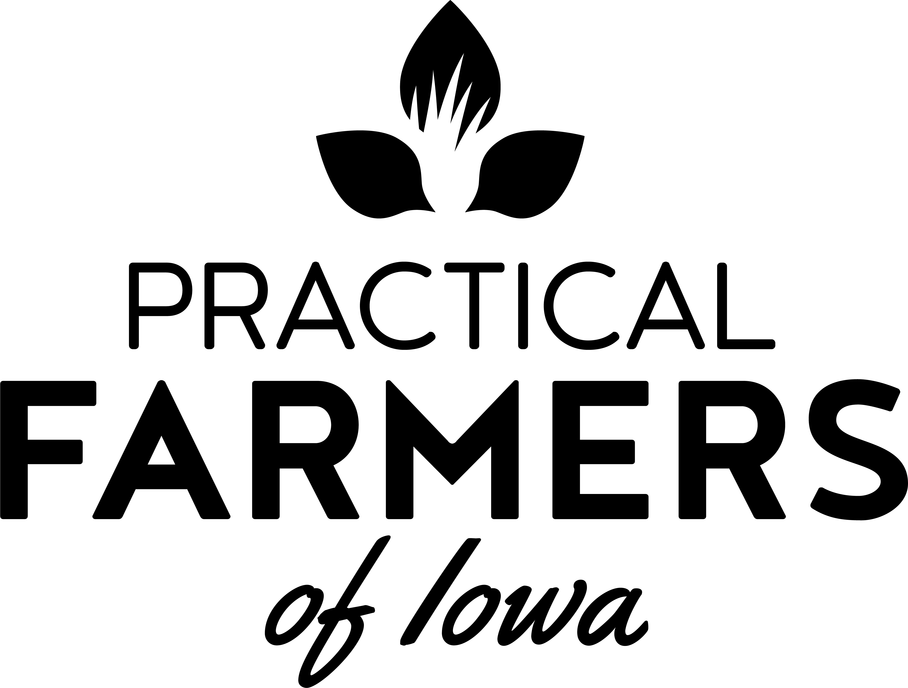
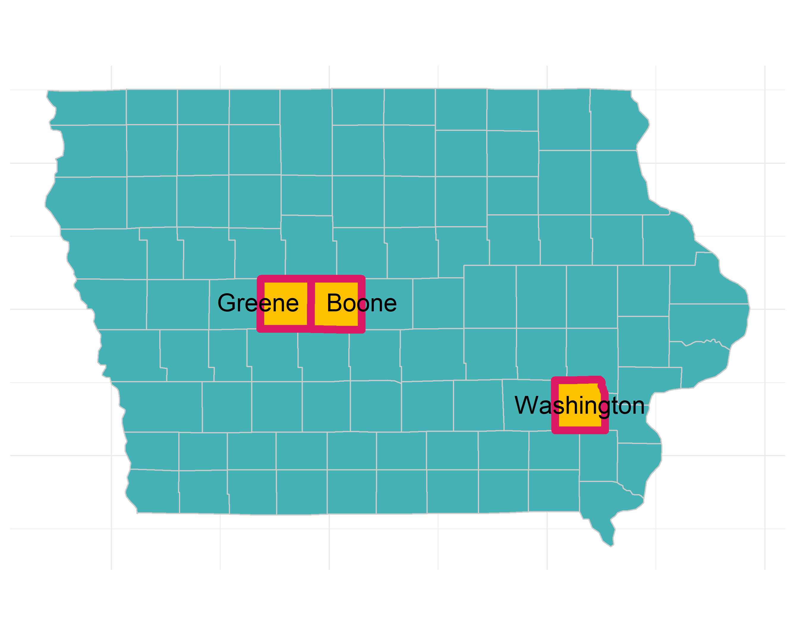

<!-- README.md is generated from README.Rmd. Please edit that file -->

```{r, include = FALSE}
knitr::opts_chunk$set(
  collapse = TRUE,
  comment = "#>",
  fig.path = "man/figures/README-",
  out.width = "100%"
)
```

# PFIweeds2020 

<!-- badges: start -->
[](https://www.tidyverse.org/lifecycle/#experimental)
<!-- badges: end -->

The goal of PFIweeds2020 is to grant easy access to data and analysis functions for the 2020 Practical Farmers of Iowa project looking at the effect of cover-cropping on the weed seedbank.


## Overview  

We sampled soil from three long-term (10+ years) sites with experiments using a winter rye cover crop in a corn/soybean rotation compared to the same rotation without a winter cover crop. We took that soil back to a greenhouse, germinated the seeds, then counted/identified the weeds as we plucked them from their cozy homes and threw them on the ground. The results will be available in a publication coming soon...

## Installation

The development version from [GitHub](https://github.com/) can be accessed with:

``` r
# install.packages("devtools")
devtools::install_github("vanichols/PFIweeds2020")
```

## Example

```{r example}
library(PFIweeds2020)
```

Look at the list of weeds we found
```{r}
head(pfi_weedsplist)
```

You really want to see the raw data? 
```{r}
head(pfi_ghobsraw)
```

You can use a custom function to quickly summarise it:
Total number of weeds in each experimental unit:
```{r}
head(pfi_ghobsraw %>% pfifun_sum_byeu())
```

There is more! Probably more than you want...
