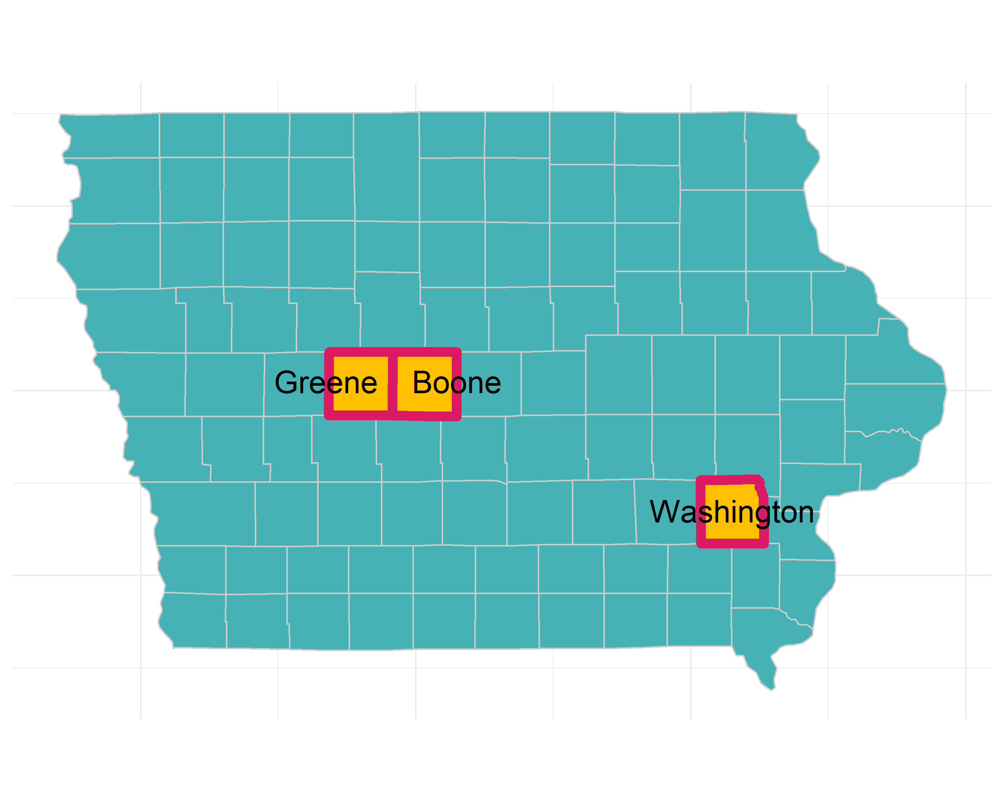

<!-- README.md is generated from README.Rmd. Please edit that file -->

# PFIweeds2020 

<!-- badges: start -->

[](https://www.tidyverse.org/lifecycle/#experimental)
<!-- badges: end -->

The goal of PFIweeds2020 is to grant easy access to data and analysis
functions for the 2020 Practical Farmers of Iowa project looking at the
effect of cover-cropping on the weed seedbank.

## Overview 

We sampled soil from three long-term (10+ years) sites with experiments
using a winter rye cover crop in a corn/soybean rotation compared to the
same rotation without a winter cover crop. We took that soil back to a
greenhouse, germinated the seeds, then counted/identified the weeds as
we plucked them from their cozy homes and threw them on the ground. The
results will be available in a publication coming soon…

## Installation

The development version from [GitHub](https://github.com/) can be
accessed with:

``` r
# install.packages("devtools")
devtools::install_github("vanichols/PFIweeds2020")
```

## Example

``` r
library(PFIweeds2020)
```

Look at the list of weeds we found

``` r
head(pfi_weedsplist)
#>       common_name         scientific_name  code possible_mislabel photo_path
#> 1      water hemp amaranthus tuberculatus AMATU              <NA>         C4
#> 2 lamb's quarters       chenopodium album CHEAL              <NA>         C3
#> 3     velvet leaf    abutilon theophrasti ABUTH              <NA>         C3
#> 4    rye (cereal)          secale cereale SECCE              <NA>         C3
#> 5      nightshade      solanum ptycanthum SOLPT             SOPT7         C3
#> 6        purslane      portulaca oleracea POROL              <NA>         C4
#>   functional_grp        family
#> 1           forb amaranthaceae
#> 2           forb amaranthaceae
#> 3           forb     malvaceae
#> 4          grass       poaceae
#> 5           forb    solanaceae
#> 6           forb portulacaceae
```

You really want to see the raw data?

``` r
head(pfi_ghobsraw)
#>     obs_date obs_initials electrec_initials site_name field sys_trt cc_trt
#> 1 2019-05-03           gn                eo      Boyd   B44  silage    rye
#> 2 2019-05-03           gn                eo      Boyd   B44  silage     no
#> 3 2019-05-03           gn                eo      Boyd   B44  silage     no
#> 4 2019-05-03           gn                eo      Boyd   B44  silage    rye
#> 5 2019-05-03           gn                eo      Boyd   B44  silage     no
#> 6 2019-05-03           gn                eo      Boyd   B44  silage    rye
#>   crop_2019 rep blockID       trayID AMATU CHEAL ABUTH SECCE SOLPT POROL RAPSA
#> 1      corn   2   B44_2 B44_2-rye-t2     2     7    NA    NA    NA    NA    NA
#> 2      corn   2   B44_2  B44_2-no-t1     3    NA    NA    NA    NA    NA    NA
#> 3      corn   4   B44_4  B44_4-no-t2    18    NA    NA    NA    NA    NA    NA
#> 4      corn   1   B44_1 B44_1-rye-t3    NA     3    NA    NA    NA    NA    NA
#> 5      corn   1   B44_1  B44_1-no-t1    39    10    NA    NA    NA    NA    NA
#> 6      corn   1   B44_1 B44_1-rye-t2    18    16    NA    NA    NA    NA    NA
#>   SETFA EUPMA SETVI POLAV CONCA TAROF DIGSA PLAMA OXAST POLPY UG UB
#> 1    NA    NA    NA    NA    NA    NA    NA    NA    NA    NA NA NA
#> 2    NA    NA    NA    NA    NA    NA    NA    NA    NA    NA NA NA
#> 3    NA    NA    NA    NA    NA    NA    NA    NA    NA    NA NA NA
#> 4    NA    NA    NA    NA    NA    NA    NA    NA    NA    NA NA NA
#> 5    NA    NA    NA    NA    NA    NA    NA    NA    NA    NA NA NA
#> 6    NA    NA    NA    NA    NA    NA    NA    NA    NA    NA NA NA
```

You can use a custom function to quickly summarise it: Total number of
weeds in each experimental unit:

``` r
head(pfi_ghobsraw %>% pfifun_sum_byeu())
#> # A tibble: 6 x 8
#> # Groups:   site_name, field, sys_trt, cc_trt, rep [6]
#>   site_name field sys_trt cc_trt   rep blockID totseeds totseeds_m2
#>   <chr>     <chr> <chr>   <chr>  <dbl> <chr>      <dbl>       <dbl>
#> 1 Boyd      B42   grain   no         1 B42_1         34        663.
#> 2 Boyd      B42   grain   no         2 B42_2         12        234.
#> 3 Boyd      B42   grain   no         3 B42_3          9        175.
#> 4 Boyd      B42   grain   no         4 B42_4          7        136.
#> 5 Boyd      B42   grain   no         5 B42_5         17        331.
#> 6 Boyd      B42   grain   rye        1 B42_1        116       2261.
```

There is more\! Probably more than you want…
